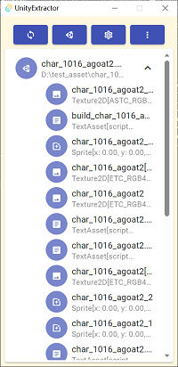
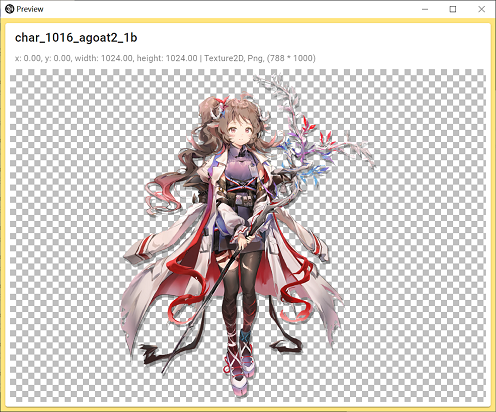

# UnityExtractor

A Unity asset extractor base on `Tauri` + `Vue` + `Vuetify`

Make All Asset Extract action in **ONE** App

## App current appearance

## Feature

- [ ] Support most Unity asset type load & Preview & direct export
    - [x] Texture
    - [x] TextAsset
    - [x] Sprite
- [ ] Support custom script load & execute
    - [ ] Load via cabi
    - [ ] LUA support
    - [ ] WASM script support

## Contribution
- You can feel free to use English or Chinese to open an issue or pull request.

## relate repos
- [unity-rs](https://github.com/yuanyan3060/unity-rs): Rust implement unity unpacker
- [AssetStudio](https://github.com/Perfare/AssetStudio): Populate asset extractor tool 